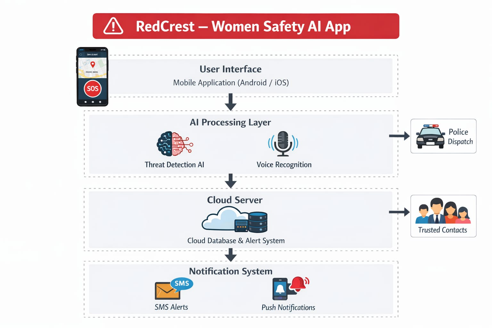

<p align="center">
  
</p>

# red-crest 🎯

## Basic Details

### Team Name: CoreCoders

### Team Members
- Member 1: jesiya - mar baselious christian college of engineering and technology
- Member 2: anjali - mar baselious christian college of engineering and technology

### Hosted Project Link
[https://red-crest-34ue.vercel.app/login](https://red-crest-34ue.vercel.app/login)

### Project Description
RedCrest is a predictive AI-powered women's safety travel application designed to transition safety from a reactive measure to a proactive one. It utilizes real-time behavioral anomaly scoring and dynamic safety mapping to protect users during solo travel.

### The Problem statement
Women face significant risks during solo travel, especially at night or in unfamiliar areas. Traditional safety apps primarily focus on reactive alerts (SOS) after an incident occurs, failing to anticipate or prevent potential dangers before they escalate.

### The Solution
RedCrest solves this by implementing weighted anomaly scoring (monitoring speed, heading, and stop duration deviations) and dynamic safety heatmaps powered by crime, lighting, and crowd density data. This allows the app to predict danger and alert trusted contacts automatically if a user's behavior deviates from their intended path.

---

## Technical Details

### Technologies/Components Used

**For Software:**
- **Languages used:** JavaScript (ES6+), HTML5, CSS3
- **Frameworks used:** Vite (Build Tool)
- **Libraries used:** Leaflet.js (Interactive Maps), Leaflet.heat (Dynamic Heatmaps), Firebase (Auth & Real-time Database), Lucide (Iconography)
- **Tools used:** VS Code, Git, Antigravity AI, Vercel (Hosting)

**For Hardware:**
- **Main components:** Arduino Uno / ESP32, ADXL345 Accelerometer, SIM800L GSM/GPS Module
- **Specifications:** Low-power consumption, MQTT protocol for data transmission, logic-level 3.3V/5V compatibility.
- **Tools required:** Arduino IDE, Breadboard, Jumper Wires, 3.7V Li-ion Battery.

---

## Features

List the key features of your project:
- Feature 1: **Predictive Danger Mapping** - Real-time heatmaps based on historical crime data and environmental factors like lighting and crowd density.
- Feature 2: **Behavioral Anomaly Scoring** - AI-driven detection of irregular movement patterns such as sudden stops, erratic speed, or path deviations.
- Feature 3: **Safe Route Prediction** - Suggests the safest routes instead of just the fastest, prioritizing well-lit and populated areas.
- Feature 4: **Emergency SOS Button** - One-tap immediate alert to trusted contacts and police dispatch with live location tracking and automated countdowns.

---

## Implementation

### For Software:

#### Installation
```bash
npm install
```

#### Run
```bash
npm run dev 
```

### For Hardware:

#### Components Required
- **ESP32 Microcontroller**: Main processing unit with WiFi/Bluetooth capabilities.
- **ADXL345 Accelerometer**: For impact and fall detection (detecting physical struggle).
- **SIM800L GSM Module**: To send SMS alerts even without an active internet connection.
- **Push Button**: For manual SOS activation.

#### Circuit Setup
1. Connect the ADXL345 SDA/SCL pins to ESP32 I2C pins.
2. Interface the SIM800L module via UART (TX/RX) with a common ground.
3. Connect the manual SOS button to a digital input pin (Pull-down configuration).
4. Power the system using a 3.7V Lipo battery with a voltage regulator.

---

## Project Documentation

### For Software:

#### Screenshots (Add at least 3)


*RedCrest Home Screen: Real-time map with safety heatmaps and predictive routing.*


*Route Monitoring: AI detects path deviation and displays the anomaly score.*


*SOS Alert: Active panic state with live location sharing to trusted contacts.*

#### Diagrams

**System Architecture:**


*The RedCrest architecture consists of a Mobile UI layer (built with JS/Leaflet) that transmits telemetry data to an AI Processing layer. This layer calculates threat scores and updates the Cloud Server (Firebase), which in turn triggers the Notification System (SMS/Push) to alert police and trusted contacts.*

**Application Workflow:**


*The workflow begins with user authentication, followed by setting a travel destination. As the user moves, the AI monitors telemetry for deviations. If an anomaly is detected, the app enters a 'Warning' state, which escalates to a full 'SOS' state if the user doesn't respond.*

---

## Additional Documentation

### For Web Projects with Backend:

#### API Documentation

**Base URL:** `https://red-crest-34ue.vercel.app/api`

##### Endpoints

**POST /api/auth/login**
- **Description:** Authenticates the user and returns a session token.
- **Request Body:**
```json
{
  "email": "user@example.com",
  "password": "hashed_password"
}
```
- **Response:**
```json
{
  "status": "success",
  "token": "jwt_token_here"
}
```

**GET /api/safety/heatmap**
- **Description:** Retrieves real-time safety risk levels for a given bounding box.
- **Parameters:**
  - `lat_min` (float): Southern boundary
  - `lng_min` (float): Western boundary
- **Response:**
```json
{
  "status": "success",
  "data": [
    {"lat": 12.97, "lng": 77.59, "risk": 0.8}
  ]
}
```

---

### For Scripts/CLI Tools:

#### Command Reference

**Basic Usage:**
```bash
node scripts/process-crime-data.js [options] [arguments]
```

**Available Commands:**
- `process [file]` - Processes raw crime CSV data into JSON format for the heatmap.
- `update-risk` - Re-calculates safety scores based on newly reported incidents.

**Options:**
- `-h, --help` - Show help message
- `-v, --verbose` - Enable detailed logging
- `-o, --output FILE` - Specify output file path

---

## Project Demo

### Video


https://github.com/user-attachments/assets/961acbae-55ea-4630-bad2-0ce3cd3660e4


*The video demonstrates the core features of the app: real-time route monitoring, path deviation detection, and the automated SOS mechanism triggered by behavioral anomalies.*

### Additional Demos
- [Live Site](https://red-crest-34ue.vercel.app/login)
- [Project Documentation](./docs/architecture.md)

---

## AI Tools Used (Optional - For Transparency Bonus)

If you used AI tools during development, document them here for transparency:

**Tool Used:** Antigravity AI (Gemini), Cursor, GitHub Copilot

**Purpose:**
- **Anomaly Detection Logic**: Generated the weighted scoring algorithm for behavioral analysis.
- **UI/UX Design**: Brainstormed the dark glassmorphism theme and icon placements.
- **Debugging**: Fixed race conditions in Leaflet map layer rendering.

**Key Prompts Used:**
- "Calculate weighted anomaly score based on speed, heading, and stop duration deviations from a target route."
- "Create a CSS-only dark glassmorphism card style for mobile safety alerts."
- "Integrate Firebase Realtime Database with Vite for live GPS tracking."

**Percentage of AI-generated code:** Approximately 40%

**Human Contributions:**
- Core architecture design and safety logic planning.
- Custom crime data weighting and risk assessment models.
- Frontend implementation and Leaflet map integration.
- UI/UX refinements and user flow testing.

---

## Team Contributions

- **jesiya**: Frontend development, AI Anomaly Logic, Map Integration, Firebase Setup.
- **anjali**: UI/UX design, Documentation, Feature Testing, Graphics Design.

---

## License

This project is licensed under the MIT License - see the [LICENSE](LICENSE) file for details.

---

Made with ❤️ at TinkerHub
